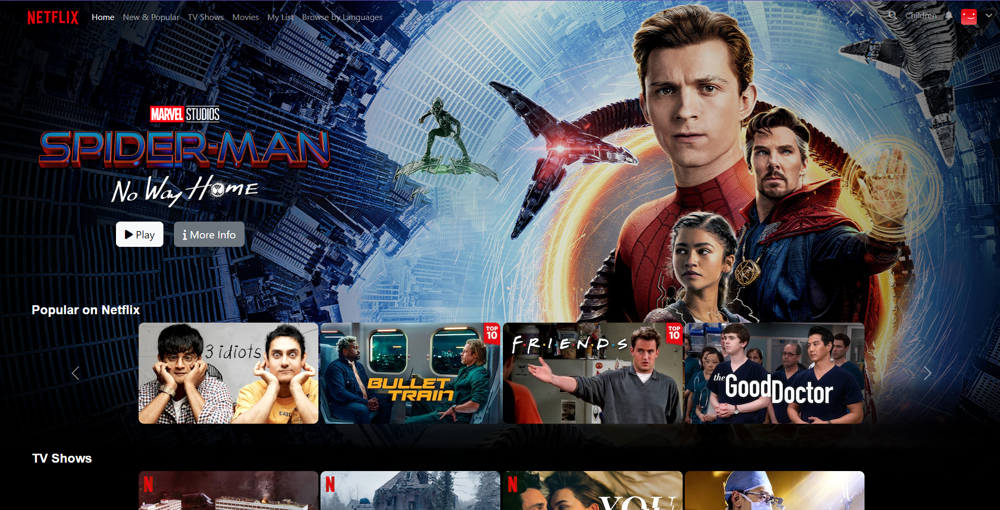
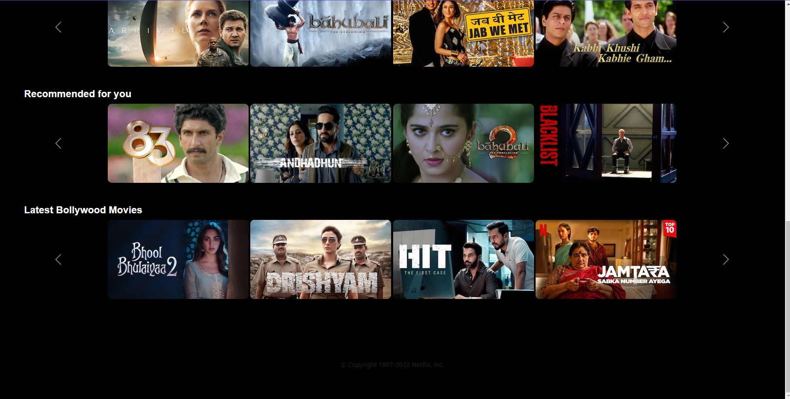

# Netflix Clone

A Netflix clone created using HTML, CSS, and Bootstrap. This project aims to replicate the user interface of Netflix, showcasing movie thumbnails.

## Demo

A live demo of the project can be found [here](https://vaibhavisloor.github.io/NetflixClone/).

Please note that the site might take some time to load, as it is hosted on a free server with limited resources.

## Features

- Displays movie thumbnails in a grid layout similar to Netflix.
- Slide through movie options.
- Trailer display of that particular movieon clicking it

## Screenshots




## Installation

1. Clone the repository:

   ```bash
   git clone https://github.com/vaibhavisloor/NetflixClone.git
   ```

2. Navigate to the project directory:

   ```bash
   cd NetflixClone
   ```

3. Open `index.html` in your preferred web browser.

## Customization

To customize the content of the Netflix clone, follow these steps:

1. Replace movie thumbnails:

   - Locate the `images` directory.
   - Replace the existing movie thumbnail images with your own images.
   - Ensure that the file names and extensions match the existing ones.

2. Modify movie details:

   - Open `index.html` in a text editor.
   - Locate the movie sections within the HTML code.
   - Update the movie titles, descriptions, and any other relevant details.

3. Customize styles:

   - Open `styles.css` in a text editor.
   - Modify the CSS properties to change the appearance of the Netflix clone.

## Future Updates
This project is actively maintained, and changes and improvements will be made soon. Stay tuned for the following updates:

Movie Trailer Display: On clicking a movie, the trailer of the movie will be displayed.
Search Feature: Addition of a search functionality to browse movies by genre, actor, or title.

## License

This project is licensed under the MIT LICENSE

## Acknowledgments

- [Bootstrap](https://getbootstrap.com/) for the responsive CSS framework.

## Disclaimer

This project is for educational purposes only and does not include any actual streaming functionality. It is intended only to showcase frontend web development skills.

## Contact

If you have any questions, suggestions, or feedback, feel free to contact me at viisloor@gmail.com
